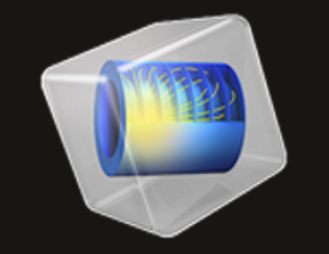

Hey there 👋

I’m Nirmal  
Master’s Student in Mechanical Engineering — University of Southern California (USC)

Right now I’m focused on:

- 🤖 Industrial robotics and automation  
- 🗺 Motion and path planning algorithms  
- 📈 Trajectory optimization under constraints  
- 🏭 Building reliable robots for industrial applications  

I enjoy turning simulation-driven designs into practical hardware systems that work in real environments.My broader work includes thermal management of high-power electronics, hydrogen fuel-cell and battery hybrid optimization, and lattice structures using topology optimization tools.

PAST WORK :

- 🔥 Thermal management using composite PCM cold plates and advanced cooling strategies  
- ⚡ Hydrogen fuel cell–battery hybrid system modeling and optimal power split control  
- 🧱 Lattice structures and lightweight topology-optimized components  
- 🔌 1 kW wireless power transfer systems with foreign object detection for EV charging  
- 🛰 Embedded systems and CubeSat payload prototyping  

PROFESSIONAL EXPERIENCE:

DST PURSE (SRMIST) (Research Assistant)

• Reduced cold plate weight and volume by 25% while improving cooling efficiency  
• Modeled hydrogen fuel cell battery hybrid systems under WLTC cycles  
• Developed 1 kW wireless power transfer prototype systems  
• Presented thermal management research at ECCE Asia 2025  

JSW Steel (Assistant Manager)

• Implemented industrial automation in large-scale hot strip mills (Siemens PLC systems)  
• Optimized microstructure and laminar cooling for high-carbon steels  
• Improved output by 12% and reduced downtime by 18% using Lean and preventive analytics  

Formula Electric (SAE) (Vehicle Engineer) 

• Designed and fabricated FSAE roll cage (Aluminum 6061)  
• Developed steering and drivetrain systems integrating PMSM and gearbox  
• Secured 4th place overall  

 Languages & Tools

  
  
  
  
  
  
  
  
  
  

I use these tools primarily for robotics, motion planning, optimization, multiphysics simulation, thermal systems, hybrid power modeling, and generative design.

Connect With Me

  

